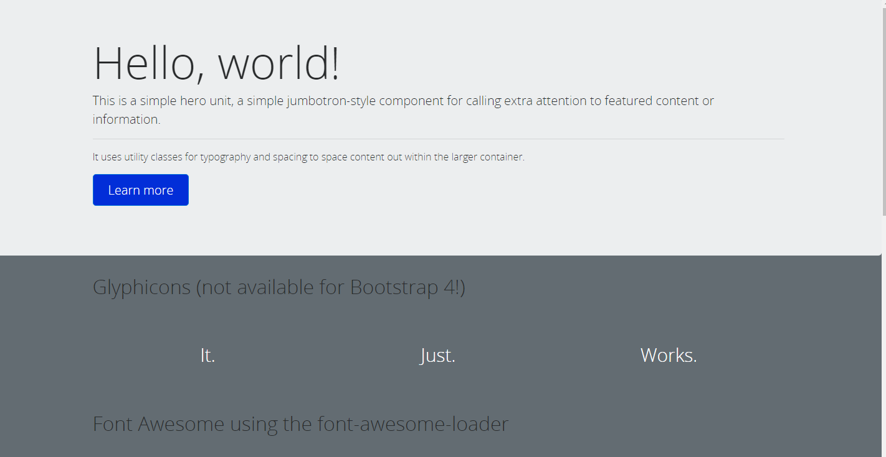

# bootstrap-loader-demo
bootstrap-loader-demo from bootstrap-loader [demos](https://github.com/shakacode/bootstrap-loader/tree/master/examples)

### Usage
```js
git clone https://github.com/liangklfangl/bootstrap-loader-demo.git
npm install
npm run bs4:default:dev
```

### Notice
(1)This demo is built on windows platform, if you want to run in linux/mac platform, you can search suggestion [here](https://github.com/shakacode/bootstrap-loader)

(2)This demo is built with bootstrap 4 instead of 3. So, ProvidePlugin is added for webpack
```js
 new webpack.ProvidePlugin({
       $: "jquery",
      jQuery: "jquery",
      "window.jQuery": "jquery",
      Tether: "tether",
      "window.Tether": "tether",
      Alert: "exports-loader?Alert!bootstrap/js/dist/alert",
      Button: "exports-loader?Button!bootstrap/js/dist/button",
      Carousel: "exports-loader?Carousel!bootstrap/js/dist/carousel",
      Collapse: "exports-loader?Collapse!bootstrap/js/dist/collapse",
      Dropdown: "exports-loader?Dropdown!bootstrap/js/dist/dropdown",
      Modal: "exports-loader?Modal!bootstrap/js/dist/modal",
      Popover: "exports-loader?Popover!bootstrap/js/dist/popover",
      Scrollspy: "exports-loader?Scrollspy!bootstrap/js/dist/scrollspy",
      Tab: "exports-loader?Tab!bootstrap/js/dist/tab",
      Tooltip: "exports-loader?Tooltip!bootstrap/js/dist/tooltip",
      Util: "exports-loader?Util!bootstrap/js/dist/util"
    }),
```
(3)In dev mode or pro mode, there is a big difference while later will extract css to a separate file which configured in `.bootstraprc`.
```yaml
extractStyles: false
```
webpack configuration like bellow:
```js
//Notice extractStyles
if (bootstraprcCustomLocation) {
  bootstrapProdEntryPoint = 'bootstrap-loader/lib/bootstrap.loader?extractStyles' +
    `&configFilePath=${__dirname}/${bootstraprcCustomLocation}` +
    '!bootstrap-loader/no-op.js';
} else {
  bootstrapProdEntryPoint = 'bootstrap-loader/extractStyles';
}
//as html template followed in pro mode
 <link rel="stylesheet" href="/assets/app.css">
 <script src="/assets/app.js"><\/script>
//only app.js is demostrated bellow
 <script src="/assets/app.js"><\/script> 
```

(4)next part will inject `const jQuery=require("jquery")` to our bootstrap file which heavily depend on jQuery 
```js
  { test: /bootstrap\/dist\/js\/umd\//, 
    loader: 'imports-loader?jQuery=jquery' 
  }
```

### preview



### Description of Branch daily/0.0.1

In branch of daily/0.0.1, you can see that we extract css  to an individual file which you can find in *public/assets/common.css*. (You must first change app.js or other files to trigger HMR, then common.css will generate in that folder). You should also know that, in webpack configuration file of webpack.config.js, we do not need to add *extract-text-webpack-plugin* to plugins, bootstrap-loader will do that automatically. But, you need first to do that:
```js
env:
  development:
    extractStyles: true
    //There is for testing, you should not extract css in dev mode
  production:
    extractStyles: true
```


Reference:

[React系列学习笔记：4.React应用中使用Bootstrap](http://www.jianshu.com/p/98138ff23e4e)

[webpack多页应用架构系列（十）：如何打造一个自定义的bootstrap](http://www.tuicool.com/articles/zqIVbuA)

[bootstrap-loader](https://github.com/shakacode/bootstrap-loader)

[Magic and useful Tether](http://tether.io/)

[import-loader](https://github.com/webpack-contrib/imports-loader)

[font awesome:图标字体，完全css控制](https://www.iteblog.com/archives/1099.html)
[font-awesome-loader](https://github.com/liangklfang/font-awesome-loader/blob/master/docs/usage-webpack2.md)